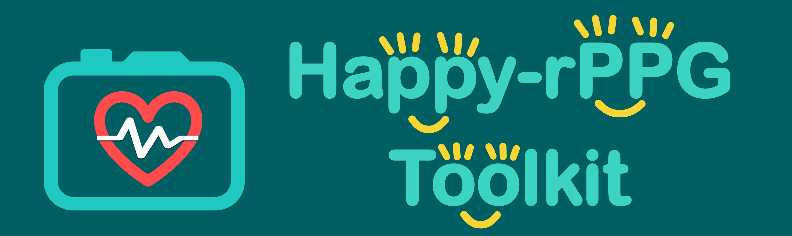
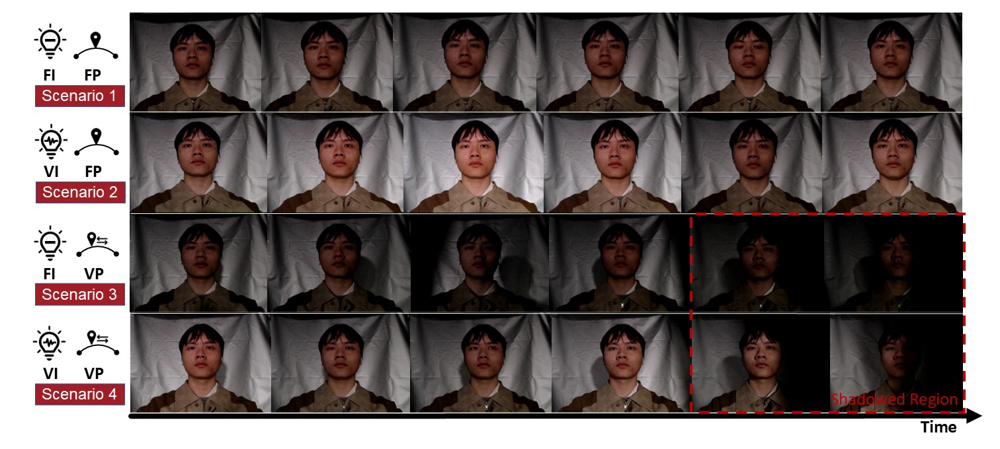

<p align="center">
  
</p>

# Happy-rPPG Toolkit

> A lightweight, easy-to-debug rPPG framework.

## 📌 Introduction
TODO

## 🧠 Dataset: DLCN

**DLCN (Dynamic-lighting Conditions at Night)** is a dataset collected specifically for rPPG signal evaluation under complex lighting environments. [More](https://github.com/dalaoplan/DLCN)
- **98 volunteers**, each recorded under 4 lighting setups:
  1. Fixed intensity and fixed position
  2. Varying intensity and fixed position
  3. Fixed intensity and moving position
  4. Varying intensity and moving position
- **784 video samples**, covering both **rest** and **exercise** states
- Captured in a **darkroom** with synchronized physiological signal acquisition

> 💾 File Format: `.h5`  
> 🗂 Naming Convention: `P1_1` ~ `P1_8`

### 📷 Sample Frame Snapshots



## 🔬 Included Datasets
TODO
## 🔬 Included Methods

The following rPPG methods are included or supported:

| Method        | Type          | Description                                   |
|---------------|---------------|-----------------------------------------------|
| CHROM         | Traditional   | Color space-based baseline                    |
| POS           | Traditional   | Popular skin-tone enhancement technique       |
| ICA           | Traditional   |                                               |
| GREEN         | Traditional   |                                               |
| PBV           | Traditional   |                                               |
| LGI           | Traditional   |                                               |
| TSCAN         | Deep Learning |                                               |
| PhysNet       | Deep Learning |      |
| EfficientPhys | Deep Learning |                         |
| iBVPNet       | Deep Learning |                                               |
| PhysFormer    | Deep Learning |                                               |
| RhythmFormer  | Deep Learning |                                               |

> 🧩 New models can be added by creating a new file in `models/` and registering it in `model_selector.py`.


## ⚙️ Installation
> This repository is developed and tested under the following environment: `Python 3.8`, `PyTorch 1.12.1`, `torchvision 0.13.1`

```bash
git clone git@github.com:dalaoplan/Happy-rPPG-Toolkit.git
cd Happy-rPPG-Toolkit
conda create -n Happy-rPPG-Toolkit python=3.8
pip install -r requirements.txt
```
---

## 🧪 Running Experiments
### 1 Read and modify the `train.yaml` (for training) or `inference.yaml` (for testing) files in the config directory.
### 2 Start experiment.
> train
```
python main.py --config ./config/train.yaml 
```
> test
```
python main.py --config ./config/inference.yaml 
```


## 📊 Evaluation Results
Performance of different models on DLCN dataset:
TODO


## 🧩 Extending Happy-rPPG Toolkit
* Add a new model: Create your model file in models/
  TODO

* Add a new dataset: Implement a data loader
  TODO

* Add new evaluation metric: Add in utils/metrics.py.
  TODO

## 📬 Contact

For issues, suggestions, or collaborations:
📧 Email: zhipengli@stu.cqut.edu.cn

## 💐 Acknowledgement
This work is primarily based on [rPPG-Toolbox](https://github.com/ubicomplab/rPPG-Toolbox), an excellent open-source repository for remote photoplethysmography (rPPG) research. In addition, we would like to express our sincere gratitude to the authors of [ContrastPhys](https://github.com/zhaodongsun/contrast-phys), [SiNC-rPPG](https://github.com/CVRL/SiNC-rPPG), [RhythmFormer](https://github.com/zizheng-guo/RhythmFormer), and [TemporalNormalization](https://github.com/KegangWangCCNU/TemporalNormalization) for their outstanding open-source contributions, which have greatly inspired and supported our work.


##  📚 Citation
If you use this toolkit or the DLCN dataset, please cite:
````
@article{paper,
  title={Happy-rPPGToolkit},
  author={},
  journal={},
  year={2025}
}
````